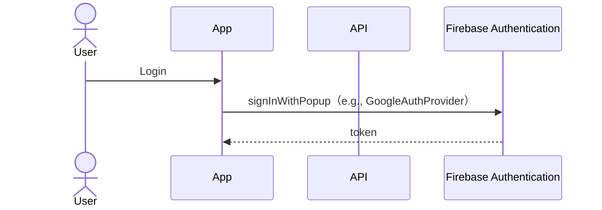
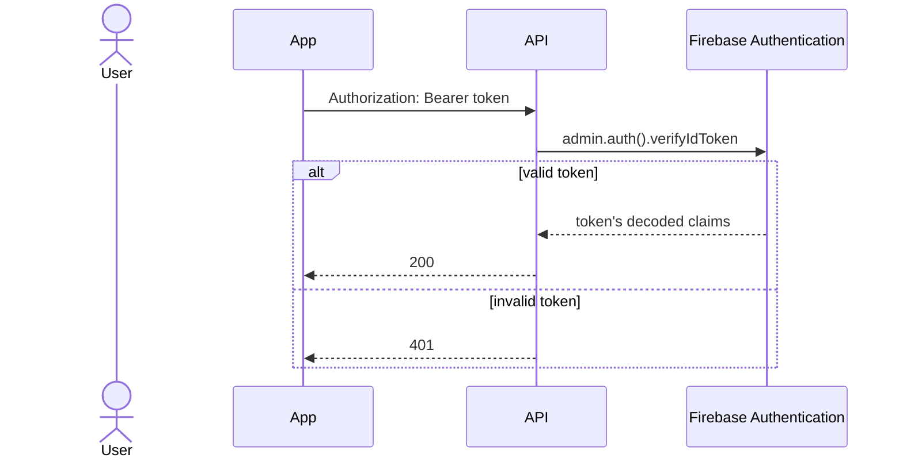
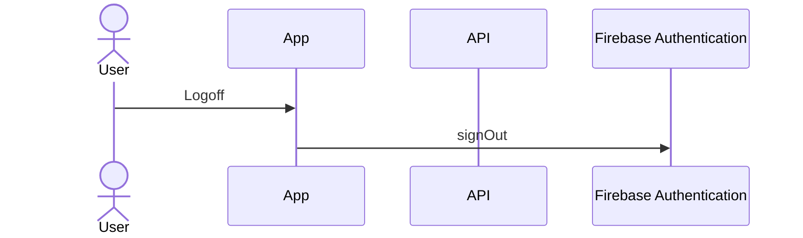

# firebase-authentication-hands-on

[live demo](https://fir-authentication-hands.web.app/)

Login)



Access API)



Logoff)



## Hosting setting

```bash
firebase login

cd app
firebase init

? Which Firebase features do you want to set up for this directory? Press Space to select features, then Enter to confirm your choices. Hosting: Configure files for 
Firebase Hosting and (optionally) set up GitHub Action deploys

=== Project Setup

First, let's associate this project directory with a Firebase project.
You can create multiple project aliases by running firebase use --add, 
but for now we'll just set up a default project.

? Please select an option: Use an existing project
? Select a default Firebase project for this directory: xxxxxxxxxxxxxxxxxxxxxxxxxx (xxxxxxxxxxxxxxxxxxxxxxxxxx)
i  Using project xxxxxxxxxxxxxxxxxxxxxxxxxx (xxxxxxxxxxxxxxxxxxxxxxxxxx)

? What do you want to use as your public directory? build

? Configure as a single-page app (rewrite all urls to /index.html)? (y/N) Yes

? Set up automatic builds and deploys with GitHub? No
? File build/index.html already exists. Overwrite? No
i  Skipping write of build/index.html

i  Writing configuration info to firebase.json...
i  Writing project information to .firebaserc...

✔  Firebase initialization complete!
```

## build

```bash
make build
```

## deploy

```bash
make deploy
```
